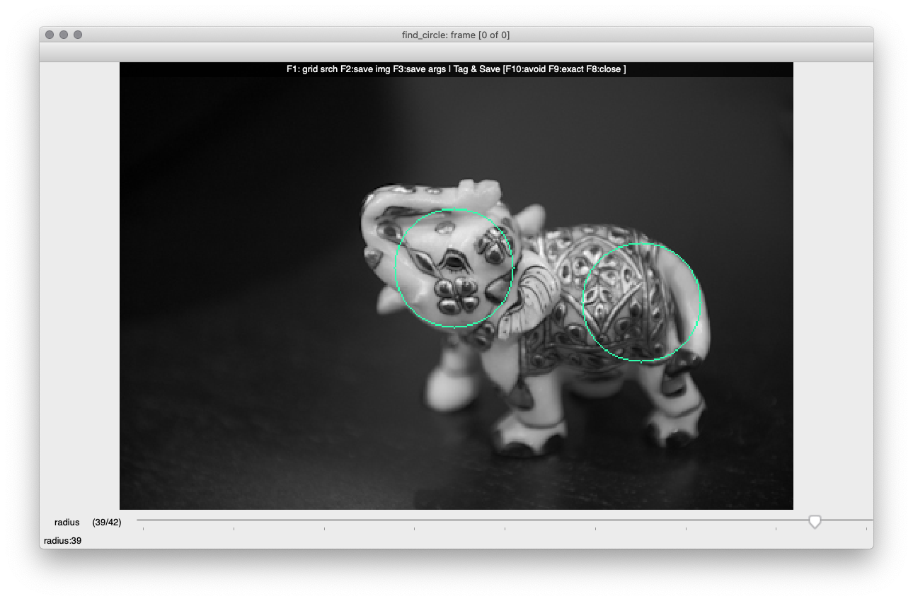

<H1>akbinod.Tuner</H1>
Binod Purushothaman : binod@gatech.edu/ak.binod@gmail.com
<br>Georgia Tech CS-6476: Spring 2021<br>
<H3>Introduction</H3>
If you're studying Computer Vision, or Reinforcement Learning, parameter tuning is probably causing you some angst. Importing this component, and copying 3 lines into your code will get you a pretty decent parameter Tuner.

<br>Here's a 5 minute introduction to the essentials. This function (the code for this example is in `example.py`) and invocation...

```{python}
def find_circle(image, radius):

    # your implementation

    return results

if __name__ == "__main__":
    find_circle(image, 42)

```

... hooked up to Tuner, become:

```{python}
#new import
import TunedFunction

#new decorator, and a 'tuner' param
@TunedFunction()
def find_circle(image, radius, tuner=None)


#new line of code to display an updated image in TunerUI
    if not tuner is None: tuner.image = updated_image

    return results

```

Your (unchanged) invocation from '__main__' now shows <code>TunerUI</code> : an openCV window with a trackbar called 'radius' which ranges from 0 to 42. The window title begins with the name of your tuned function, and the `overlay` shows the possible actions. Each time you move the slider, <code>TunerUI</code> calls <code>find_circle()</code> with a new value for 'radius'. Here's TunerUI when the trackbar is set to 39.



<br>And *that* folks, is pretty much it. Here's a good stopping point; try this out on your CV code.

At this point, you are using a thin wrapper over openCV trackbars; albeit, one that's easier to use and less disruptive to your code. There's more to <code>TunerUI</code>, like:
<ul>
<li>it runs a systematic <a href='#gridsearch'>grid search</a> over the space of your args (exhausts the search space),</li>
<li><a href='#tag'> tagging</a> args (note when theta is cold/warm/on-the-money),</li>
<li>json <a href='#serialize'>serialization</a> of invocation trees (analyze your findings, narrow your search space)</li>
</ul>

<br>So... read on, McDuff...

<H2>@TunedFunction() Decorator</H2>
Although you do give up some flexibility, compared to explicitly instantiating and configuring Tuner, just decorating your function is the quickest way of getting started.
<H3>Usage</H3>

<ol>
<li>Decorate the function you want to tune (referred to as <b>target</b>) with <code>@TunedFunction()</code>, and add a 'tuner' param to its signature. (Note: there should be no other decorator on <code>target</code>.)
<li>Begin tuning by calling <code>target</code>. <code>@TunedFunction</code> creates an instance of TunerUI (passed to <code>target</code> via the <code>tuner</code> param). You are now in the tuning loop:</li>
<ul>
<li>Switch to the Tuner GUI and adjust the trackbars.</li>
<li>Tuner will invoke your function on each change made to a trackbar.</li>
<li>Set <code>tuner.image</code> to the processed image from within <code>target</code>. This refreshes the display in Tuner's GUI.</li>
</ul>
<li>End your tuning session by pressing the Esc (or any non function key)</li>
</ol>


To restore normal operation of your function, comment out or delete the @TunedFunction() decorator.

<H3>
Tracked Parameters/What is tuned?
</H3>
Positional and keyword parameters (not varargs, or varkwargs) in your function signature are candidates for tuning. If your launch call passes an int, boolean, list or dict to any of these, then that parameter is tuned; the others are passed through to your function unchanged. Images, e.g., can't be tuned - so np.ndarray arguments are passed through to your function unchanged. Tuples of 3 ints also work, and are interpreted in a special way.
<p>

If you want to skip tuning some parameters in your <code>target</code>'s signature, set default values for them, and drop them from your launch call. A param is not tuned, if an arg is not passed to it from your launch call.

It's the <i>type of the argument</i> passed in your launch call that drives Tuner behavior, not the annotation on the parameters.

```{language=python}
#image is passed through, radius is tuned - min 0, max 50
find_circle(image, radius=50)
#same as above
find_circle( image, 50 )
#radius is tuned with values ranging between 20, and 50
find_circle( image, (50,20) )
#radius is tuned and the slider selects among [10, 50, 90]
find_circle(image, [10,50,90])
#radius is tuned and target receives one of [10, 50, 90]
#The difference is that Tuner GUI dispalys "small", "med", "large"
j = {"small":10, "med":50, "large":90}
find_circle( image, radius=j )

```
</p>
When an argument in the launch call is:
<ul>
<li>int</li>
    The trackbar's max is set to the int value passed in.
<li>tuple</li>
    The trackbar's <code>(max,min,default)</code> are taken from the tuple.
<li>boolean</li>
    The trackbar will have two settings <code>0, 1 </code> which correspond to <code>False, True</code>. The default value is whatever you have passed in. Tuner will call target with one of <code>False, True</code> depending on trackbar selection.
<li>list</li>
This is a good way to specify non int values of some managable range. Strings, floats, tuples all go in lists.

- The trackbar will have as many ticks as there are items in the list.
- Changing the trackbar selects the corresponding item from the list.
- The argument passed to target is the list item.
	E.g., when your launch call passes ['dog','cat','donut'] to the <code>radius</code> parameter, Tuner will:
    - create a trackbar with 3 positions.
	- call target passing one of the following ['dog','cat','donut'] to <code>radius</code> - whichever you've selected with the trackbar.

<br>Trivially, <code>[(3,3), (5,5), (7,7)]</code> is a list you might use for tuning the <code>ksize</code> parameter of  <code>cv2.GaussianBlur()</code>
<li>dict or json object</li>
    Very similar to list above. obj[key] is returned in the arg to target.

Consider the json below. Passing that to a parameter would create a trackbar that switches amongst "gs", "gs_blur" and "gs_blur_edge". When `target` is invoked in a tuning call, the argument passed in is the json corresponding to the selected key.

```
	preprocessing_defs = {
	"gs" :{
        "img_mode": "grayscale"
        , "blur":{"apply": false}
        , "edge": {"detect" : false}
    }
    ,"gs_blur":{
        "img_mode": "grayscale"
        , "blur":{"apply": true, "ksize": (5, 5), "sigmaX": 2}
        , "edge": {"detect" : false}
	}
   , "gs_blur_edge": {
        "img_mode": "grayscale"
        , "blur":{"apply": true, "ksize": (5, 5), "sigmaX": 2}
        , "edge": {"detect" : true, "threshold1": 150, "threshold2": 100, "apertureSize": 5}
	}

```
</ul>

### TunerUI Menu
<ul>
<li>F1 : runs a <a href='#gridsearch'>grid search</a></li>
<li>F2 : saves the image</li>
<li>F3 : <a href='#serialize'>saves</a> your Invocation Tree</li>
<li>F8 - F10 : <a href='#tag'>tags</a> and saves your Invocation Tree (see below).</li>
</ul>
<H4 id='serialize'>Saving Invocation Trees</H4>
The basic idea behind Tuner is:
<ol>
<li>...hook up Tuner and invoke your function to tune it</li>
<li>...save your observations (tags) along with theta</li>
<li>...and finally, come back and analyse the Invocation Tree saved to your output file to narrow in on your ideal theta</li>
</ol>

Saving behavior is determined principally by a couple of statics in TunerConfig.
<p><b>TunerConfig.output_dir</b>: by default this is set to `./wip` Change this before you use the other functions of Tuner.</p>
<p><b>TunerConfig.save_style</b>: This should be set to some valid combination of the flags found in `constants.SaveStyles`. The default is to overwrite the contents of the output file on each run, and to only save when explicitly asked to. </p>
<p>The following are always tracked, although only saved to file under certain circumstances:
<ul>
<li><b>args</b>: The set of args to an invocation.</li>
<li><b>results</b>: This could be explicitly set by your code like so <code>tuner.results=...</code>. If you do not set this value, tuner captures the values returned by <code>target</code> and saves them as long as they are json serializable</li>
<li><b>errored</b>: Whether an error took place during <code>target</code> invocation.</li>
<li><b>error</b>: These are execution errors encountered during <code>target</code> invocation. BTW, the most recent call is first in this formatted list, not last as you would expect from typical python output.</li>
<li><b> [insert your tag here] </b>: A complete list of all the custom tags with the value set to false, unless you explicitly tag the invocation, in which case the particular tag(s) are set to <code>True</code>.</li>
</ul>
An invocation is pushed into the output file when:
<ul>
<li>You explicitly save  - F3.</li>
<li>You tag an invocation.</li>
<li>An exception was encountered during the invocation.</li>
</ul>
The name of the output file begins with the function being tuned; and within the file, this is approximately the tree structure:
<ul>
<li>The title of the image from your carousel (see explicit instantiation below), defaulting to 'frame' </li>
<ul>
<li>The invocation key (what you see is the md5 hash of theta)</li>
<ul>
<li>args (contains each element of theta)</li>
<li>results (contains the saved or captured results of <code>target</code>)</li>
<li>each of the custom tags that you apply via the Tuner GUI</li>
</ul>
</ul>
</ul>
</ul>

<H4 id='tag'>Tagging Theta</H4>
The purpose of tuning is to find args that work for the task at hand. It might be a somewhat lengthy process, and this feature lets you tag some theta with a word that you can search for in the output file. I like using 'avoid', 'exact' and 'close', the defaults you see in the UI. You could customize this. Modify constants.py and update the `Tags` enum. Code comments there will explain your options. Pick a scheme that works for you, and stick with it. I'd recommend something like glom or jsonpath-ng to search the saved invocation tree.


<H4 id='gridsearch'>Grid Search</H4>
If you are not a "parameter whisperer", you're going to turn to brute force tuning at some point; I did. So, with 3 params, each of which could take 5 values, you're likely to be annoyed by the process, and more likely to make a costly mistake. The worst of tuning, for me, is the prospect of missing the "right set of args", thanks to NOT clicking through the various settings methodically. Fortunately, there's code for that.

<br>This feature runs through a cartesian product of the parameter values you have set up. <code>target</code> is invoked with each theta, and Tuner waits indefinitely for your input before it proceeds to the next theta.

Here's my workflow:
<ol>
<li>I start with a small range of inputs, and let Tuner search through that space.</li>
<li>When Tuner waits for input, I tag the current set of args (e.g., 'avoid' or 'close'); or just 'press any key'. I can also hit Esc to cancel the grid search.</li>
<li>After I've run through the cart (cartesian product of all arguments), I query the (json) output file to find my theta, or something close.</li>
</ol>
With explicit instantiation (i.e., using TunerUI rather than @TunedFunction), I can set how long Tuner waits, etc. I typically first run through the search space with a 40ms delay to determine if I'm "in the ball-park". If it looks like the answer or something close to it is in there, I then run through it again with a full second delay, and tag what I find interesting. If I don't find anything close in my first attempt, I open up the search space some (expand the range of values for the args).

This is about as much code as I can give you without running afoul of the GA Tech Honor Code. We can spitball some ideas to help you get more value out of the data that's captured if you follow the "Search-Inspect-Tag" workflow I've outlined above.
<ol>
<li>If you find a number of 'close' thetas, build a histogram of the various args to EACH param, using only thetas that are 'close'. That should highlight a useful arg to that param :)</li>
<li>Implement a Kalman Filter to help you narrow the grid search.</li>
</ol>

<b>Here's another good stopping point. Read on for more fine grained control.</b>
<H2>TunerUI Class</H2>

Most of the basics have been detailed above, and this just lists the differences.

With explicit instantiation, you give up the convenience of automatic trackbar GUI configuration, but gain more control over features. If you like the UX of <code>@TunedFunction</code>, see the benefits section down below to determine if it's worth it to wade through the rest of this.

Instead of TunedFunction, you import TunerUI and TunerConfig. TunerUI is the facade you work with. You could ignore TunerConfig if the default settings (e.g. when and where to save) work for you.

The basic pattern is about the same:
1. import TunerUI.
2. accept a <code>tuner</code> param with the default value of None...
3. set <code>tuner.image</code> to the processed image before you return...
4. optionally - set <code>tuner.results</code> to something that is json serializable before you return

Which is basically what you do with <code>@TunedFunction</code>, and with less code to boot.

<ol>
<li>Instantiate tuner, choosing between one and two functions to watch. </li>
<ul>
<li>There's only one set of trackbars, but you could have two distinct functions called by Tuner - main and downstream. </li>
<li>When <code>downstream</code> accesses <code>tuner.image</code>, it too gets a fresh copy the current image being processed. To get the image processed by <code>main</code>, access <code>tuner.main_image</code>.</li>
<li><code>tuner.image</code> and <code>tuner.results</code> set from <code>main</code> are displayed in the main window (the one with the trackbars).</li>
<li><code>tuner.image</code> and <code>tuner.results</code> set in <code>downstream</code> are displayed in a second window which does not have trackbars. Usually, the downstream image obscures the main one; you'll need to move it out of the way.</li>
<li>Tuner will save images separately on F2, but will combine the results of both, along with args (tuned parameters) and writes it to one json file when you press F3. Remember to keep your results compatible with json serialization.</li>
</ul>
<li>Make calls to <code>tuner.track()</code>, <code>track_boolean()</code>, <code>track_list()</code> or <code>track_dict()</code> to define tracked/tuned parameters</li>
<li>Make a call to tuner.begin(). [You do not use a launch call, like you did with <code>TunedFunction()</code>]. This launches tuner, and then, as usual, each change to a trackbar results in a tuning call to <code>target</code>.
<ul>
<li>Tuner curries args to formal parameters which match by name to a tracked parameter.</li>
<li>All tracked parameters are also accessible off <code>tuner</code>. E.g., <code>tuner.radius</code>. This enables you to tune variables that are not part of the formal arguments to your function. Wondering if you should set <code>reshape=True</code> in a call to <code>cv2.resize()</code>? Well, just add a tracked parameter for that (without adding a parameter to your function), and access its value off <code>tuner</code>. The idea is to keep your function signature the same as what the auto-grader would expect - minimizing those 1:00am exceptions that fill one with such bonhomie. These args are also accesible as a dict via tuner.args</li>
<li id='carousel'><code>tuner.begin()</code> accepts a carousel argument.</li>
<ul>
<li>A carousel is a group of images that you want tuner to deal with as a set. </li>
<li>You typically want to do this to find parameters that will work across all images in the set.</li>
<li>Use the helper call <code>tuner.carousel_from_images()</code> to set up a carousel. This takes 2 lists.
<ul>
<li>The first is the list of parameters to <code>target</code> that take images. <code>target</code> might work with multiple images, and this list is where you specify the names of those parameters which expect images.</li>
<li> The second is a list of paths to image files. If <code>target</code> works with 2 images, then each element of this second list must be a tuple of two image paths. If it works with three images, then each element must be a tuple of three image paths, et cetera. </li>
<li>When <code>Tuner</code> is aware of file paths, it uses the file name in <code>TunerUI</code>'s window title, (instead of just 'frame'.</li>
<ul>
</ul>
</ul>
</ul>
</ul>
</ol>

You cannot mix Tuner with partials and decorators (things blow up unperdictably) - just the func please.

Some of the gains are:
<ul>
<li>Being able to tune hyper-parameters, or other control variables, without having them be parameters to your function. This keeps your signature what your auto-grader expects. Once ascertained, you should remove these from <code>Tuner</code></li>
<li>Process a <a href=#carousel>carousel of images</a>, remembering settings between images.</li>
<li>Insert a thumbnail into the main image (set <code>tuner.thumbnail</code> before you set <code>tuner.image</code>. This is useful, e.g., when you are matching templates. You could do this with <code>@TunedFunction()</code> as well.</li>
<li>View the results of two processes in side by side windows. A few use cases for side-by-side comparison of images:
<ul>
<li>Show your pre-processing output in <code>main</code>; and traffic sign identification output in <code>downstream</code>.</li>
<li><code>match_template()</code> output in one vs. <code>harris_corners()</code> output in the other.</li>
<li>What your noble code found, vs. what the built in CV functions found (I find this view particularly revealing, also, character building).</li>
</ul>
<li>Controlling aspects of <a href='#gridsearch'><code>tuner.grid_search()</code></a>. Please see the docstrings for more information. </li>
<li>You get to control whether the GUI returns list items vs list indices; keys vs dict objects etc. </li>
<li>Finally, as anyone who has written a Decorator knows, things can get squirrelly when exceptions take place within a partial... you could avoid that whole mess with explicit instantiation of TunerUI.</li>
</ul>

Apart from the few differences above, <code>TunerUI</code> and <code>TunedFunction()</code> will give you pretty much the same UX. You do have access to a few additional bells and whistles with the latter, and the docstrings should explain those.

The accompanying <code>example.py</code> illustrates some uses. Play around, and let me know if you think of ways to improve this.
</p>

### OpenCV GUI
Your experience of this GUI is going to be determined by the version of various components - OpenCV, and the Qt backend. Tuner does take advantage of a couple of the features of the Qt backend, but those are guarded in <code>try</code> blocks, so you shouldn't bomb.
If you're in CS-6476, you've installed <code>opencv-contrib-python</code>. If not, might I suggest...

If you don't see the status bar in Tuner GUI, you are missing <code>opencv-contrib-python</code>
If you don't see the overlay after each trackbar change, you are missing <code>Qt backend</code>

### Important Safety Tip
I've debugged this thing extensively, but I haven't had the time to bullet proof it. It will behave if your arguments are well behaved; but caveat emptor...

### Licensing
It's only licensed the way it is to prevent commercial trolling. For all other purposes...

```Fork it, make something beautiful.```